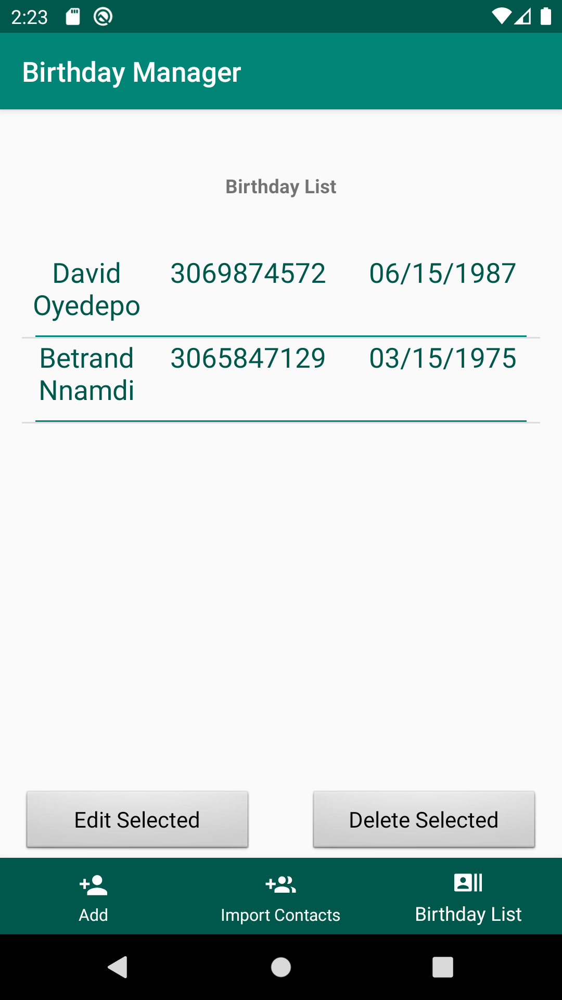

# MobileComputingProject
This repository contains the Android Studio project of the Birthday Manager Application

## Table of Contents

- [Introduction](#introduction)
- [Screenshots](#screenshots)
- [Features](#features)
- [Feedback](#feedback)
- [Author](#author)

## Introduction

The Birthday Manager allows you to save the contacts and birthdates of friends and family. Then you can choose when to be reminded to send a message or give them a call. 

## Screenshots

**Developed for Android operating sysrem**

The Birthday Manager user interface is an Android application which mainly a main page, which shows a brief tutorial on how to use the app, the Add New page, for adding contacts to the birthday list, and the "Birthday List" page for viewing the contacts added to the list. 

  

  

  

## Features

A few of the things you can do with the Birthday Manager:

* Input a person's full name and birthdate
* Add a person's inputted details to the birthday list
* View the entries stored in the birthday list
* Delete an entry from the birthday list

## Feedback
If there's anything you'd like to chat about, please feel free email the author at bcn991@uregina.ca

## Author

This project was developed by Betrand Nnamdi for the CS855 Mobile Computing Project
